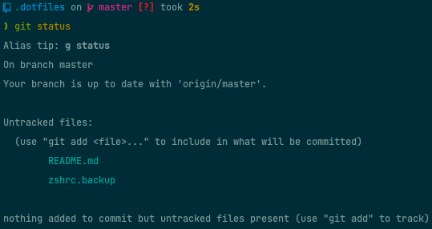

# Dotfiles



## Installation

**Warning**: Before running these dotfiles please make a backup of your current configuration files and review the content of this repository carefully.
When running this script all of your configuration will be overwritten. 

Run this to bootstrap the installation:
```bash
git clone https://github.com/Max-Leopold/dotfiles.git ~/.dotfiles
cd ~/.dotfiles
script/bootstrap
```

To install all brew packages run:
```bash
cd ~/.dotfiles
./homebrew/brew.sh 
```

To configure macOs defaults run:
```bash
cd ~/.dotfiles
./macos/set-defaults.sh 
```

## Inspiration

This repository is heavily based on these awesome dotfiles:

- https://github.com/mathiasbynens/dotfiles
- https://github.com/driesvints/dotfiles
- https://github.com/holman/dotfiles
- https://github.com/bw-matthew/dotfiles

I mixed ideas from all of those and added some new stuff from my own configuration.